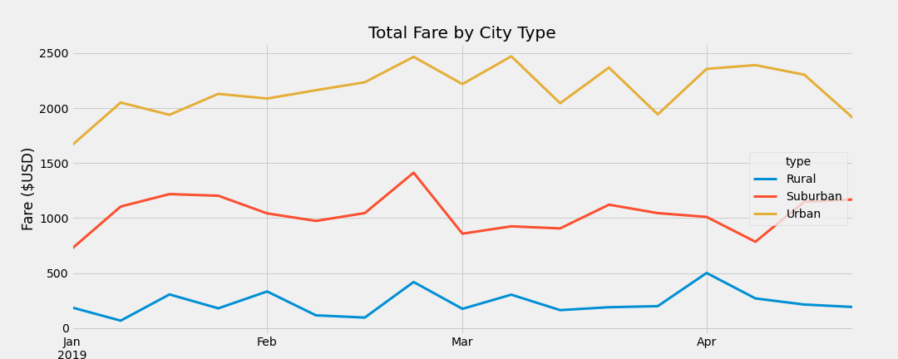

# PyBer Data Analysis

## Overview of the project
This project was undertaken for PyBer, a ride-sharing app company valued at $2.3 billion. The purpose of the project is to analyze all the rideshare data from January to early May of 2019 and create a compelling visualization for the CEO, V. Isualize. The dataset consisted of two files:
- city_data, with details of the cities such as type of city and the number of drivers in each city
- ride_data, with details of the rides taken in each city

The purpose of the latest assignment was to:
- Create a summary dataframe of ride-sharing data by city type
- Create a multiple-line chart of total fares over time for each city type

The analysis was carried out using 'Pandas' and 'Matplotlib' libraries in Python on Jupyter notebook.

## Results

 

### Total Rides
From the summary data, it was observed that the total rides in Urban cities (1,625) was 13 times of the rides in Rural cities (125) and 2.6 times of the rides taken in Suburban cities (625)
### Total Drivers
In proportion to the number of rides, it was observed that the total number of drivers in Urban cities was the highest, followed by Suburban . The total number of drivers in Urban cities (2,405) was 30.8 times of drivers in Rural cities (78) and 4.9 times of drivers in Suburban cities (490), which is twice the number of rides taken.
### Total Fares
Again, in proportion to the number of rides taken, the total fare generated is highest at Urban, followed by Suburban. The total fare generated at Urban cities is 9.2 times that of Rural cities, and 4.5 times that of Suburban cities
### Avg Fare per Ride
In contrast to the above parameters, the average fare per ride was lowest at Urban cities ($24.53) and highest at Rural cities ($34.62). The fare at Rural cities was 1.4 times that of Urban cities and fare at Suburban cities was 1.26 times that of Urban cities.
### Avg Fare per Driver
Similar to average fare per ride, the average fare per ride was lowest at Urban cities ($16.57) and highest at Rural cities ($55.49). Despite the similarity, the average fare for drivers in Urban cities was 3.35 times lower than that of Rural cities, and 2.38 times lower than that of Suburban cities.

Looking at the data further, it was observed that the total number of drivers is higher than the total number of rides in Urban cities. This suggests that some of the drivers do not get any rides or fares.

 

From the graph it can be seen that there are fluctuations in the fare generated, with a few weeks with higher profit compared to others. It can also be seen that there are few weeks, especially the first few weeks, where fare generated in Urban cities increases, but drops in Rural or Suburban cities. This suggests that there is a higher demand in those weeks in Urban cities compared to Suburban or Rural cities.

## Summary

**Recommendation 1:** The average fare per driver is quite low in Urban cities compared to the other cities. This disparity can be accounted for if each driver has a higher number of rides, but looking at the ride data, each driver does not even account for a full ride since there are higher number of drivers compared to rides taken. We would look at additional data to understand the root cause. Based on the additional data, we can focus on reshuffling.

**Recommendation 2:** From the trendlines, it can be seen that the fare generated during the first few weeks of the month are higher compared to other weeks in Urban cities. This suggests that there is a higher demand during those weeks. This could be because people are more comfortable with spending for a few weeks after they getting paid. We can utilize that by: 
- advertising more during those periods
- recruiting or reshuffling drivers from Suburban or Rural cities to keep up with the demand

**Recommendation 3:** There is a dip in demand during March in the Suburban cities, compared to higher demand in Rural or Urban cities. Also, the demand increases in April in Suburban cities while there is a corresponding drop in other cities. Recruiting new drivers can be adjusted based on this flux. Also, the existing drivers can be employed in other areas or if possible, moved to nearby cities to avoid the need for additional recruiting. This idea requires further analysis. 

